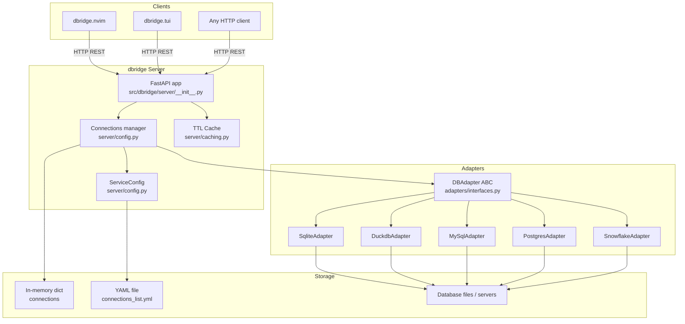
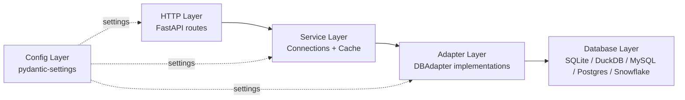
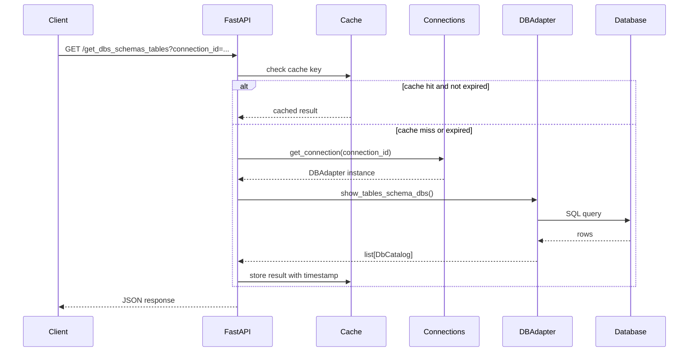

# Architecture: dbridge

## Overview

dbridge is a single-process HTTP API server that acts as a bridge between UI database clients and multiple database engines. It exposes a unified REST API so clients never need to know which database they are talking to.

## High-Level Architecture

## Layered Design

## Request Lifecycle

## Connection Identity

Connection IDs are deterministic: `md5(adapter + connection_config) + "--" + connection_name`. This means the same physical connection config always maps to the same hash, enabling connection reuse across requests.

## Single vs Multi Connection

Adapters declare `is_single_connection()`:
- **True** (SQLite, DuckDB): all named connections sharing the same hash reuse the same underlying connection object.
- **False** (MySQL, PostgreSQL, Snowflake): each named connection gets its own connection object, enabling concurrent queries.

## Deployment

The server is started via `python -m dbridge.server.app`, which calls `uvicorn.run(app, host=settings.host, port=settings.port)`. Default port is **3695**.
