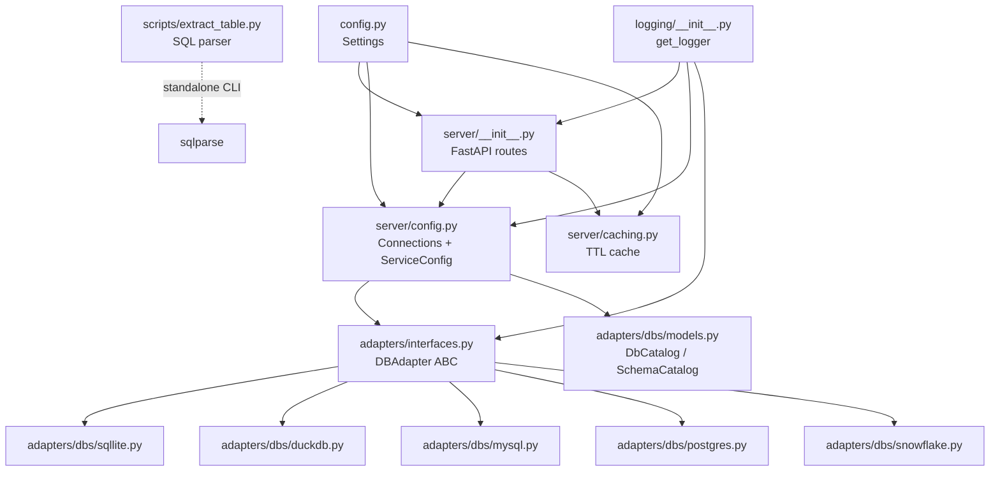
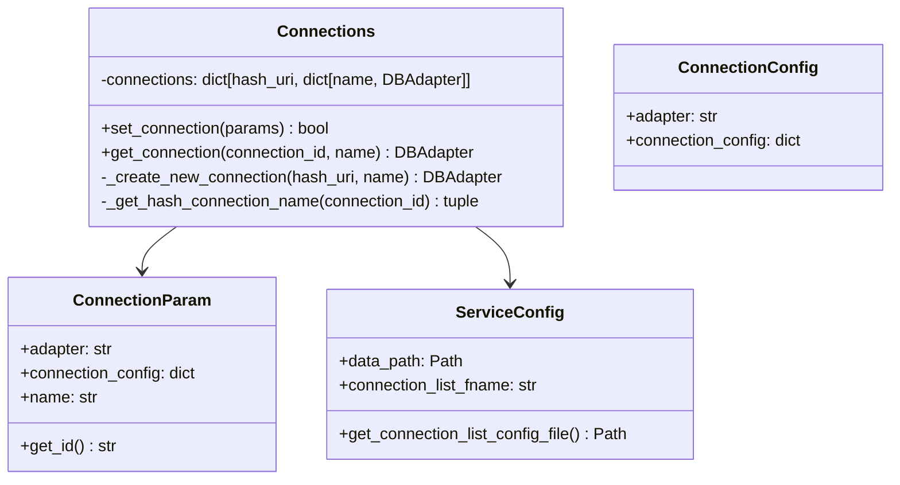

# Components: dbridge

## Component Map



---

## FastAPI Routes (`server/__init__.py`)

The entire HTTP surface lives in one file. A module-level `Connections()` instance is shared across all requests.

| Route | Method | Purpose |
|---|---|---|
| `/adapters` | GET | List installed adapter names |
| `/connections` | GET | List persisted connections |
| `/connections` | POST | Create/register a connection |
| `/get_dbs_schemas_tables` | GET | Full catalog: databases → schemas → tables |
| `/get_columns` | GET | Columns for a specific table |
| `/get_all_columns` | GET | All columns across all tables |
| `/query_table` | GET | `SELECT *` from a table (cached) |
| `/run_query` | POST | Execute arbitrary SQL |

---

## Connections (`server/config.py`)

Manages the lifecycle of `DBAdapter` instances.



Key behaviors:
- `get_connection` falls back to persisted YAML connections if the in-memory dict doesn't have the hash.
- `set_connection` is a no-op if the connection already exists (returns `False`).

---

## DBAdapter ABC (`adapters/interfaces.py`)

All adapters implement this contract:

| Method | Signature | Description |
|---|---|---|
| `show_columns` | `(table, db?, schema?) → list[str]` | Column names for a table |
| `get_all_columns` | `(db?, **kwargs) → list[str]` | All columns across all tables |
| `show_tables_schema_dbs` | `() → list[DbCatalog]` | Full catalog |
| `run_query` | `(query) → list[dict]` | Execute SQL, return rows as dicts |
| `is_single_connection` | `() → bool` | Whether to reuse one connection |
| `get_capabilities` | `() → list[CapabilityEnums]` | Optional feature flags |

---

## Adapter Implementations

### SqliteAdapter
- Connects via `sqlite3.connect(uri)` where `uri` can be a file path or `:memory:`.
- `is_single_connection()` → `True`.
- Uses `sqlite3.Row` for dict-like row access.
- `run_query` uses `fetchmany(limit=100)`.

### DuckdbAdapter
- Connects via `duckdb.connect(uri)`.
- `is_single_connection()` → `True`.
- Uses `information_schema.columns` and `information_schema.tables`.
- `run_query` uses `fetch_df_chunk(limit).to_dict("records")` — returns pandas DataFrame chunks.
- `get_all_columns` returns `"table_name.column_name"` formatted strings.

### MySqlAdapter
- Uses `pymysql` (optional dep).
- `is_single_connection()` → `False`.
- Declares `CapabilityEnums.USE_DB` capability.

### PostgresAdapter
- Uses `psycopg2` (optional dep).
- `is_single_connection()` → `False`.
- Declares `CapabilityEnums.USE_SCHEMA` capability.

### SnowflakeAdapter
- Uses `snowflake-connector-python` (optional dep).
- `is_single_connection()` → `False`.
- Declares both `USE_DB` and `USE_SCHEMA` capabilities.
- Uses `SHOW TERSE OBJECTS` style queries for catalog discovery.

---

## TTL Cache (`server/caching.py`)

Simple in-memory dict cache keyed by SHA-256 of concatenated string arguments.

- TTL controlled by `EXPIRATION_SECONDS` (default 120s, env: `dbridge_expiration_seconds`).
- Applied to: `get_columns`, `get_all_columns`, `query_table`, `get_dbs_schemas_tables`.
- **Not applied** to `run_query` (POST endpoint — always executes live).

---

## Settings (`config.py`)

`pydantic-settings` class with env prefix `dbridge_`. Reads from environment variables. A `test.env` file exists at the repo root for local testing.

---

## extract_table Script (`scripts/extract_table.py`)

Standalone CLI utility. Parses a SQL string and prints the table name from the first `SELECT` statement's `FROM` clause. Used by UI clients for autocomplete.

```
python -m dbridge.scripts.extract_table "SELECT * FROM users WHERE id=1"
# → users
```

---

## Logging (`logging/__init__.py`)

`get_logger(name, level)` returns a cached logger (module-level `_loggers` dict). Default name is `APP_NAME` (`"dbridge"`). Outputs to stderr via `StreamHandler`.
