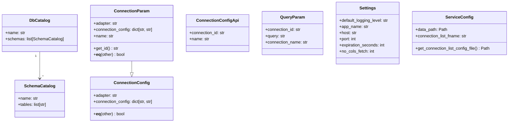

# Data Models: dbridge

## Model Hierarchy



---

## Catalog Models (`adapters/dbs/models.py`)

### `SchemaCatalog`
Pydantic `BaseModel`. Represents one schema within a database.

| Field | Type | Description |
|---|---|---|
| `name` | `str` | Schema name (e.g. `"public"`, `"main"`) |
| `tables` | `list[str]` | Table names within this schema |

### `DbCatalog`
Pydantic `BaseModel`. Represents one database (or catalog).

| Field | Type | Description |
|---|---|---|
| `name` | `str` | Database/catalog name |
| `schemas` | `list[SchemaCatalog]` | Schemas within this database |

### `INSTALLED_ADAPTERS`
Module-level constant: `["sqlite", "duckdb"]`. Reflects which adapters are always available without optional deps.

---

## Connection Models (`server/config.py`)

### `ConnectionConfig`
Pydantic `BaseModel`. Minimal connection descriptor — what gets persisted to YAML.

| Field | Type | Default | Description |
|---|---|---|---|
| `adapter` | `str` | — | Adapter name (`"sqlite"`, `"duckdb"`, etc.) |
| `connection_config` | `dict[str, str]` | `{}` | Driver-specific config (e.g. `{"uri": "..."}`) |

Custom `__eq__` compares both fields.

### `ConnectionParam`
Extends `ConnectionConfig`. Used in POST `/connections` request body.

| Field | Type | Default | Description |
|---|---|---|---|
| `name` | `str` | `"default"` | Logical connection name |

`get_id()` returns `md5(adapter + str(connection_config)) + "--" + name`.

### `ConnectionConfigApi`
Response model for POST `/connections`.

| Field | Type | Description |
|---|---|---|
| `connection_id` | `str` | The deterministic connection ID |
| `name` | `str` | Connection name |

### `QueryParam`
Request body for POST `/run_query`.

| Field | Type | Default | Description |
|---|---|---|---|
| `connection_id` | `str` | — | Target connection |
| `query` | `str` | — | SQL to execute |
| `connection_name` | `str` | `"default"` | Override connection name |

---

## Settings Models

### `Settings` (`config.py`)
`pydantic-settings` `BaseSettings`. Env prefix: `dbridge_`.

| Field | Env var | Default | Description |
|---|---|---|---|
| `default_logging_level` | `dbridge_logging_level` | `"INFO"` | Log level |
| `app_name` | `dbridge_app_name` | `"dbridge"` | Logger name |
| `host` | `dbridge_host` | `"0.0.0.0"` | Bind host |
| `port` | `dbridge_port` | `3695` | HTTP port |
| `expiration_seconds` | `dbridge_expiration_seconds` | `120` | Cache TTL |
| `no_cols_fetch` | `dbridge_no_cols_fetch` | `1000` | Max columns in DuckDB `get_all_columns` |

### `ServiceConfig` (`server/config.py`)
`pydantic-settings` `BaseSettings`. Controls file persistence.

| Field | Default | Description |
|---|---|---|
| `data_path` | `~/.config/dbridge` | Directory for config files |
| `connection_list_fname` | `"connections_list.yml"` | YAML file name |

On import, `ServiceConfig` creates `data_path` and touches the YAML file.

---

## YAML Persistence Format

`connections_list.yml` stores a list of `ConnectionConfig` dicts:

```yaml
- adapter: sqlite
  connection_config:
    uri: /home/user/mydb.sqlite
- adapter: duckdb
  connection_config:
    uri: /home/user/analytics.duckdb
```

---

## Cache Entry Format

Internal cache dict: `{ sha256_key: (result, datetime) }`. Not exposed via any model — purely internal to `caching.py`.
