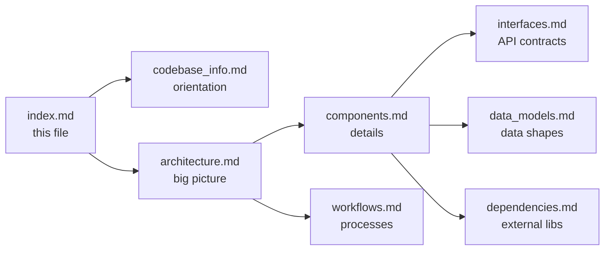

# dbridge Documentation Index

## How to Use This Knowledge Base

This index is the primary entry point for AI assistants. Read this file first, then consult the specific files listed below based on the type of question.

**Quick lookup guide:**

| Question type | File to read |
|---|---|
| "How does the server start / what port does it use?" | `architecture.md` |
| "What REST endpoints exist?" | `interfaces.md` |
| "How do I add a new database adapter?" | `workflows.md` → section 6 |
| "What Pydantic models are used?" | `data_models.md` |
| "What does component X do?" | `components.md` |
| "What are the dependencies / optional installs?" | `dependencies.md` |
| "How does caching work?" | `components.md` → TTL Cache section |
| "How are connections stored?" | `data_models.md` → YAML Persistence |
| "How does CI/release work?" | `workflows.md` → section 7 |
| "What env vars configure the server?" | `codebase_info.md` → Configuration table |

---

## File Summaries

### `codebase_info.md`
High-level project facts: directory layout, tech stack table, adapter matrix, all env vars with defaults, and persistent storage location. Start here for orientation.

### `architecture.md`
System architecture with Mermaid diagrams. Covers: client→server→adapter→database flow, layered design, request lifecycle sequence diagram, connection identity scheme, single vs multi connection behavior, and deployment.

### `components.md`
Per-component breakdown. Covers: FastAPI route table, `Connections` class behavior, `DBAdapter` abstract interface, per-adapter implementation notes (SQLite, DuckDB, MySQL, PostgreSQL, Snowflake), TTL cache mechanics, `Settings`, `extract_table` script, and logging factory.

### `interfaces.md`
Complete REST API reference with request/response shapes. Covers all 8 endpoints, the `DBAdapter` abstract interface, the capability system (`USE_DB`, `USE_SCHEMA`), connection ID format, and per-adapter `connection_config` key contracts.

### `data_models.md`
All Pydantic models with field tables. Covers: `DbCatalog`, `SchemaCatalog`, `ConnectionConfig`, `ConnectionParam`, `ConnectionConfigApi`, `QueryParam`, `Settings`, `ServiceConfig`, YAML persistence format, and cache entry format.

### `workflows.md`
Step-by-step process flows as Mermaid sequence/flowchart diagrams. Covers: server startup, creating a connection, cached query execution, arbitrary query execution, connection lookup logic, adding a new adapter, and CI/release pipeline.

### `dependencies.md`
All dependencies with versions and purpose. Covers: runtime deps, optional adapter deps, dev/test/type-check deps, build system, and notable dependency caveats (pandas/numpy overhead, unconditional optional adapter imports).

---

## Key Facts for Quick Reference

- **Default port**: 3695
- **Entry point**: `python -m dbridge.server.app`
- **Built-in adapters**: `sqlite`, `duckdb`
- **Optional adapters**: `mysql`, `postgres`, `snowflake` (install with extras)
- **Cache TTL**: 120 seconds (env: `dbridge_expiration_seconds`)
- **Config persistence**: `~/.config/dbridge/connections_list.yml`
- **Connection ID format**: `md5(adapter+config)--name`
- **All env vars prefixed**: `dbridge_`
- **Build tool**: Hatch; release triggered by any git tag push

---

## Relationships Between Files

