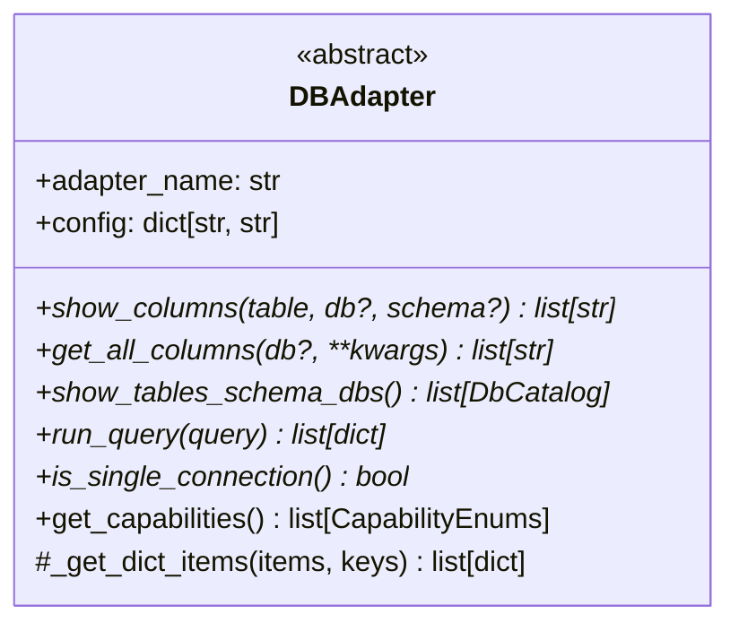

# Interfaces: dbridge

## REST API

Base URL: `http://localhost:3695` (default)

### GET /adapters
Returns the list of installed adapter names.

**Response**: `["sqlite", "duckdb"]` (plus optional adapters if installed)

---

### GET /connections
Returns all persisted connections (from YAML file). Does not include in-memory-only connections.

**Response**:
```json
[
  { "adapter": "sqlite", "connection_config": { "uri": "/path/to/db.sqlite" } }
]
```

---

### POST /connections
Registers a new connection. Creates the adapter instance in memory and persists config to YAML.

**Request body**:
```json
{
  "adapter": "sqlite",
  "connection_config": { "uri": "/path/to/db.sqlite" },
  "name": "my_db"
}
```

**Response**:
```json
{ "connection_id": "<md5hash>--my_db", "name": "my_db" }
```

The `connection_id` is deterministic: `md5(adapter + connection_config) + "--" + name`.

---

### GET /get_dbs_schemas_tables
Returns the full catalog hierarchy for a connection.

**Query params**: `connection_id` (required)

**Response**:
```json
[
  {
    "name": "mydb",
    "schemas": [
      { "name": "public", "tables": ["users", "orders"] }
    ]
  }
]
```

---

### GET /get_columns
Returns column names for a specific table.

**Query params**: `connection_id`, `table_name`, `dbname` (optional), `schema_name` (optional)

**Response**: `["id", "name", "email"]`

---

### GET /get_all_columns
Returns all columns across all tables (used for autocomplete).

**Query params**: `connection_id`, `table_name` (optional), `dbname` (optional), `schema_name` (optional)

**Response**: `["users.id", "users.name", "orders.id"]`

---

### GET /query_table
Executes `SELECT * FROM <table>` and returns up to 100 rows. Result is cached.

**Query params**: `connection_id`, `table_name`, `dbname` (optional), `schema_name` (optional)

The query is constructed using the adapter's capabilities:
- `USE_DB` → prefixes `dbname.`
- `USE_SCHEMA` → prefixes `schema_name.`

**Response**: `[{ "id": 1, "name": "Alice" }, ...]`

---

### POST /run_query
Executes arbitrary SQL. Not cached.

**Request body**:
```json
{
  "connection_id": "<md5hash>--default",
  "query": "SELECT * FROM users LIMIT 10;",
  "connection_name": "default"
}
```

**Response**: `[{ "id": 1, "name": "Alice" }, ...]`

---

## DBAdapter Interface

Defined in `src/dbridge/adapters/interfaces.py`. All adapters must implement:



---

## Capability System

`CapabilityEnums` (StrEnum) signals which SQL qualifiers an adapter supports:

| Capability | Value | Effect on `query_table` |
|---|---|---|
| `USE_DB` | `"use_db"` | Prepends `dbname.` to table name |
| `USE_SCHEMA` | `"use_schema"` | Prepends `schema_name.` to table name |

Adapters that don't override `get_capabilities()` return `[]` (no qualifiers).

---

## Connection ID Format

```
<md5_hex(adapter + str(connection_config))>--<connection_name>
```

Example: `a1b2c3d4e5f6...--default`

The `--` separator is used to split hash from name in `_get_hash_connection_name()`.

---

## Adapter Config Contracts

Each adapter expects specific keys in `connection_config`:

| Adapter | Required keys | Notes |
|---|---|---|
| SQLite | `uri` | File path or `:memory:` |
| DuckDB | `uri` | File path, `:memory:`, or `:default:` |
| MySQL | adapter-specific | Passed to `pymysql.connect(**config)` |
| PostgreSQL | adapter-specific | Passed to `psycopg2.connect(**config)` |
| Snowflake | adapter-specific | Passed to snowflake connector |
