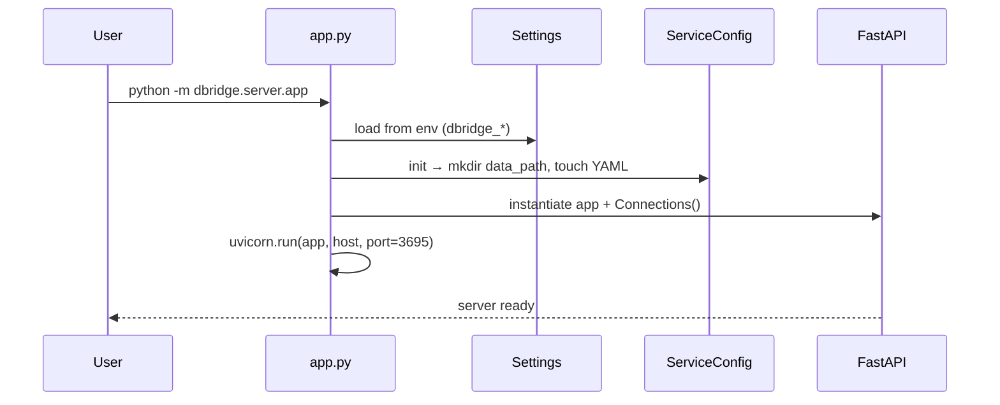
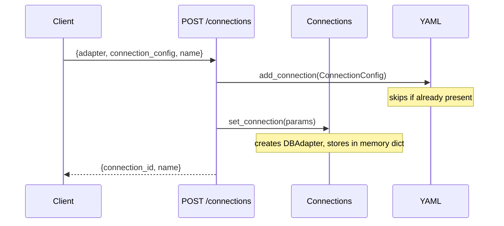
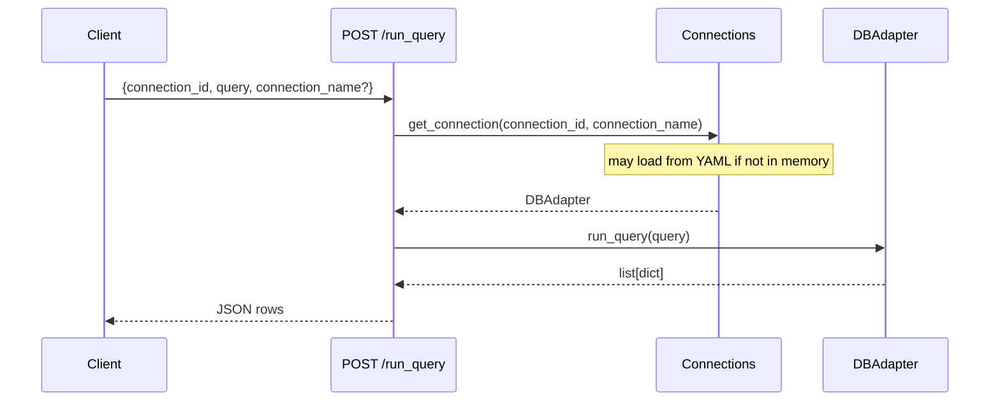
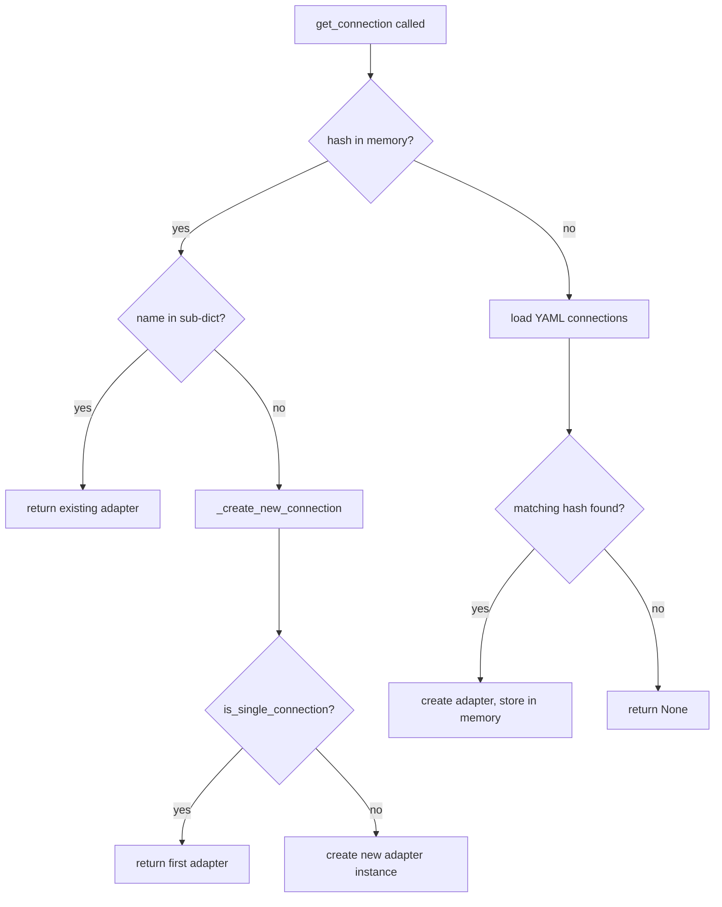
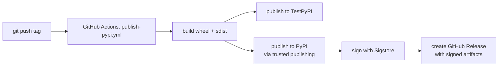

# Workflows: dbridge

## 1. Server Startup



---

## 2. Creating a Connection



The `connection_id` is deterministic — calling POST again with the same config returns the same ID without creating a duplicate.

---

## 3. Executing a Cached Query

```mermaid
sequenceDiagram
    participant Client
    participant Route Handler
    participant cache_value()
    participant Connections
    participant DBAdapter

    Client->>Route Handler: GET /get_dbs_schemas_tables?connection_id=...
    Route Handler->>cache_value(): lambda + cache key args
    cache_value()->>cache_value(): sha256(args) → lookup in cache dict
    alt hit and age < 120s
        cache_value()-->>Route Handler: cached result
    else miss or expired
        cache_value()->>Connections: get_connection(connection_id)
        Connections-->>cache_value(): DBAdapter
        cache_value()->>DBAdapter: show_tables_schema_dbs()
        DBAdapter-->>cache_value(): list[DbCatalog]
        cache_value()->>cache_value(): store (result, now) in cache
        cache_value()-->>Route Handler: result
    end
    Route Handler-->>Client: JSON
```

---

## 4. Running an Arbitrary Query (not cached)



---

## 5. Connection Lookup (Connections.get_connection)



---

## 6. Adding a New Database Adapter

To add a new adapter:

1. Create `src/dbridge/adapters/dbs/<name>.py` implementing `DBAdapter`.
2. Implement all abstract methods: `show_columns`, `get_all_columns`, `show_tables_schema_dbs`, `run_query`, `is_single_connection`.
3. Optionally override `get_capabilities()` to return `USE_DB` / `USE_SCHEMA`.
4. Register in `server/config.py` → `create_adapter_connection()` factory function.
5. Add optional dep to `pyproject.toml` under `[project.optional-dependencies]`.
6. Add adapter name to `INSTALLED_ADAPTERS` in `adapters/dbs/models.py` if it should be a core dep.

---

## 7. CI / Release Workflow



Tags follow the pattern `alpha_X.Y.Z` (e.g. `alpha_0.2.10`). Any tag push triggers the workflow.
